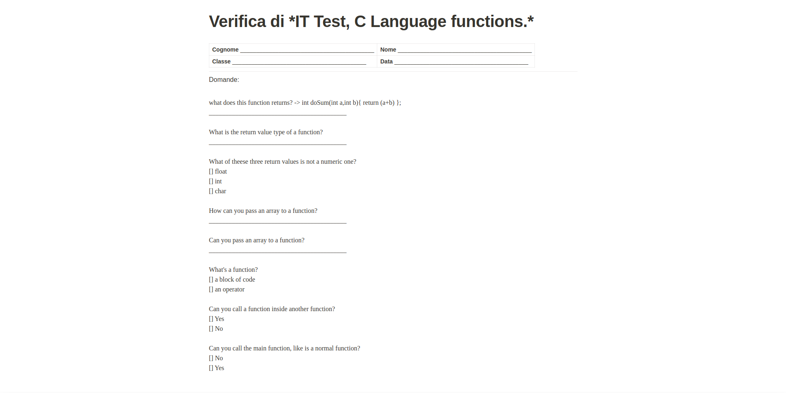
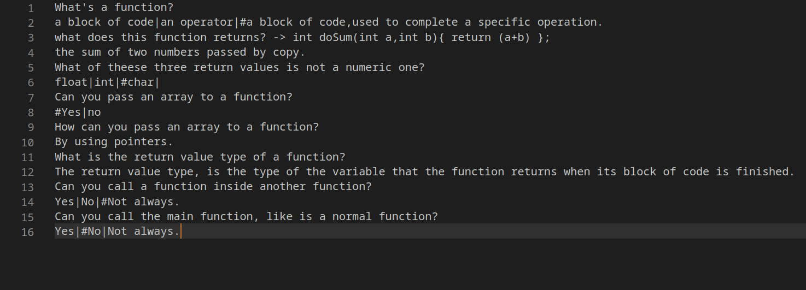
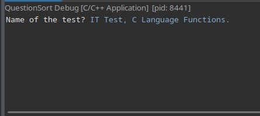
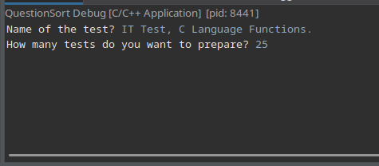

# QuestionSort-Teacher-Test-Tool
QuestionSort, is a simple CLI based tool for teachers, which is able to create custom tests, shuffled in their questions and possible answers.

*It also creates a file with all the correct answers in it, in order to help teachers correct the tests.*

To use QuestionSort, you have to insert the answers in the "MasterKey.qsrt" file, located in the same directory as the binary file.

### Answers and the multiple-choice question within it (if there are any) will be automatically shuffled.

---

## Examples of tests created using this tool:


---

## To load questions👇

```
Always remember to put your questions on two lines, the first one should be the question to display, in the second line, write the answer(s).
```

### If you want to insert a multiple choice question:
- Write the question in the first line
- In the line below,Use the pipe symbol '|', to separate multiple choice answers, than put the hashtag sign '#' in front of the correct answer.

Example👇

Do you like this project?

Yes|no|#bro this is bulls***

---
### If you want to insert an open answer-question:
- Write the answer in the first line
- Write a possible answer in the line below, it will be written in the "ForTeachers.qsrt" file.

---
## Usage
### Example of "MasterKey.qsrt" file:


### Running the executable:

|||
|--------------------------------------|------------------------------|


